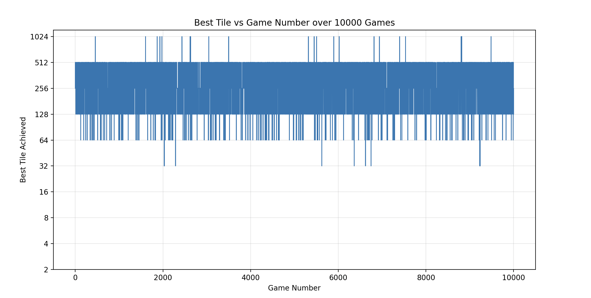

# tiletrials

A collection of 2048 related projects. Just for fun!

At the core of these projects lies my implementation of a 2048 tile game WASD simulator.
- Project 0: 2048 Board Simulator
- Project 1: Repeatable Sequence Tester
- Project 2: Optimal Sequence Finder
- Project 3: Algorithmic Agents

## Project 1: Repeatable Sequence Tester

### Motivation

The strongest motivation for this project is to find an easy way for me to win 2048.
There are already well documented strategies to get a good score in the game 2048, such as expectiminimax or snake-weighting towards a corner. However, I want to see if there was a short, repeatable, easily memorable pattern of ( <= ~10) moves that could acheive at least one '2048' tile a good chunk of the time on random boards. An example could be ASDSW, where W,A,S,D commonly represent the 4 directions in video gaming. 

There probably exist robust mathematical or algorithmic approaches to proving/finding such a strategy (eg. [MDP approach](https://jdlm.info/articles/2018/03/18/markov-decision-process-2048.html)). Given the results from that link and the stochastic nature of the game, I personally hypothesize that I will not find such a pattern, especially given my self-imposed constraint of ~10 moves. In fact, if such a pattern existed, I'm sure that would've been a well-known fact by now. However, the journey (building the game myself and seeing how far my guesses can get) to proving that right (or, hopefully, wrong) for myself is my real reward. 

### Outline
  1) I will first attempt to accurately build my own version of 2048
  2) Then, I plan to simulate a variety of self-selected patterns on generated boards to see how they perform
  3) Finally, I'll collect some (hopefully) thought-provoking statistics based on the results

### Goals
  1) To find a viable short sequence of moves that can comfortably score a 2048 tile
  2) To overcome any math/coding-related subproblems I come across while using clean coding practices
  3) To try my hand at small-scale, informal independent research (define, hypothesize, test, collect)

Finally, I enjoy casual coding and the process of building things, so I hope to have a lot of fun!

The parts below this detail how I used the completed simulator.

### Testing Methods and Logical Guessing
I ran 10000 randomly generated games for each guessed sequence. For the sequence, I allowed upto 2000 repeats, as I noticed the average number of moves to complete a game were usually below 1000. Hence, even though I allow for an upper bound of 20 million moves, I am running 2-6 million moves due to most games hitting "Game Over" early.

Putting a limit on the sequence also adds complexity to each guess. For example, if my sequence is "SD", to snake-weight towards the bottom-right corner, and I then try "ASD", to move left every so often, to avoid stuck boards, then I should also notice that A will be performed at the same rate as S or D, as in, ~33% of the time, which is not snake-weighting anymore.

With the 10 character limit, I have the space to have A only perform 10% of the time ("ASDSDSDSDS"), which is closer to what I want, but still contains an A to shake things up and maybe save a stuck board from a game over and wasting moves. 

I tried to see whether repeating patterns within my input itself would lead to anything, eg. "ASDSASDSD", 

At one point, I thought of adding special logic to help a game get unstuck. In fact, I did. For example, if a game is not over, but the sequence does not contain/ is not at a viable move, then it would play a random one. However, that defeats the purpose of the experiment of building a sequence that I think can beat the game, so I removed it. Thus, if I am using only A,S and D, and notice, through printing, that my games are getting stuck, I can add in a W, which would run ,at minimum, 10% of the time.

### Results
Here are the plotted results for 10000 games for the pattern "ASDS":

Time taken = 4 minutes 57 seconds

Average number of moves = 311

Best Tile / Frequency    

32  : 9

64  : 193

128 : 1698

256 : 5277

512 : 2799

1024 : 24       

### Discussion
Almost there!! The aim to would be to push the dark plotted band further up, so that we get closer to a 2048. Moreover, these results show that if you just repeat "ASDS" in a game of 2048, you have a ~53% chance of hitting at least one 256, and a ~28% chance of reaching a single 512. Perhaps, one can use that to reach a decent board quickly and then play slower with other strategies. Most other patterns I tried so far had their dark bands between 128 and 256, while this goes one level higher. The patterns "ASDSASDS{D/S}{D/S}" also perform similarly.

I will update more findings here, especially if I reach an elusive 2048. If it is done, this project should be accessible from my personal [website](https://vihaanlearnscode.github.io/) as well.

### Future Work
  1) Add a feature that can set a spawn seed for more accurate testing
  2) Add better plots - the current line plots can be confusing
  3) Add a frontend for users ??

## Project 2: Optimal Sequence Finder
  Building off my first project, I now flip the script. Given a single initial board, which repeatable string of length n will solve it the best?
  Here are the results for a random board, where n = 4:

## Project 3: Algorithmic Agents

### Motivation
  I wanted to replication how I play the game. Whenever I make a move, I think of the maximum tile I can create next, without giving much thought to the consequences it will have to the rest of the board.
  I have made three agents so far. 
  The first one motivated by pure tile maximization. Choose the next move that scores the largest tile value.
  The second one motivated by overall board score maximization. Choose the next move that scores the maximum board score.
  The third adds some thought. What if multiple moves allow for maximizing my next highest tile, but I select the one that also keeps the sum of the board low? This is my naive
  'minsum-maxtile' approach.

### Results
  I ran all three agents over 10000 random games. These agents are not deterministic due to tie-breaking best move choices using randomness. The games anyways are not due to random tile spawning.
  Results for Agent 1: pure tile maximization:

Best Tile   :    Frequency (%)   
                            
16       :       8     (0.08%)

32       :       180   (1.80%)

64       :       1102  (11.02%)

128      :       3838  (38.38%)

256      :       4620  (46.20%)

512      :       252   (2.52%)                               
  
  Results for Agent 2: pure board maximization:
  
  Best Tile   :    Frequency (%)   
  
  16       :       13     (0.13%)
  
  32       :       210    (2.10%)
  
  64       :       1129   (11.29%)
  
  128      :       3857   (38.57%)
  
  256      :       4532   (45.32%)
  
  512      :       259    (2.59%)

  Results for Agent 3: naive  'minsum-maxtile' :

Best Tile   :    Frequency (%)   

16      :       6   (0.06%)

32      :       150   (1.50%)

64      :       1122   (11.22%)

128      :       3939   (39.39%)

256      :       4525   (45.25%)

512      :       258   (2.58%)                             

  
# Acknowledgements:
These projects, by their nature, draws heavy inspiration from Gabriele Cirulli, the creator of the popular [2048](https://github.com/gabrielecirulli/2048).
However, in the spirit of learning from this endeavor, I never looked at the linked code myself, and so my implementation will differ.

